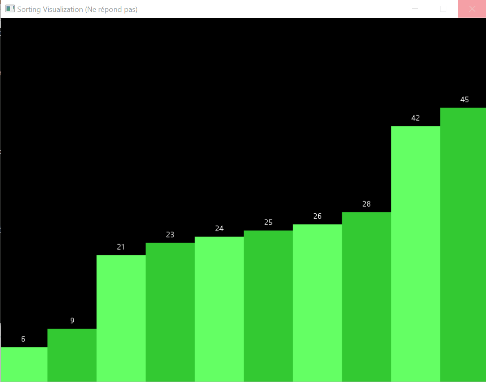

# Insertion Sort Visualizer

This program demonstrates the insertion sort algorithm visually using the SDL library for graphics and text rendering.

## Features

- **Sorting Visualization**: Visual representation of the insertion sort algorithm in action.
- **Interactive User Interface**: Menu-driven system allowing users to input data, generate random arrays, and view sorting information.
- **SDL Graphics**: Utilizes SDL for graphical rendering to provide a dynamic representation of the sorting process.
- **User Input Handling**: Allows users to input their data or generate random arrays for sorting.

## Requirements

- **SDL Library**: Ensure SDL2 is installed to run the graphical visualization.
- **C Compiler**: Use a C compiler compatible with SDL2 library.

## Usage

1. **Compile the Program**:
    - Use a C compiler with SDL2 support.
    - Example: `gcc -o insertion_sort_visualizer insertion_sort_visualizer.c -lSDL2 -lSDL2_ttf -lSDL2_gfx`

2. **Run the Program**:
    - Execute the compiled binary: `./insertion_sort_visualizer`

3. **Interaction**:
    - Follow the on-screen instructions to generate random arrays, input data, and view the sorting visualization.

## Project Report

For a detailed report and documentation, please refer to [Project_Report.pdf](Insertion-sort-visualiser.pdf).

